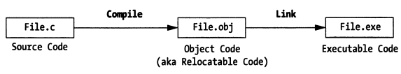
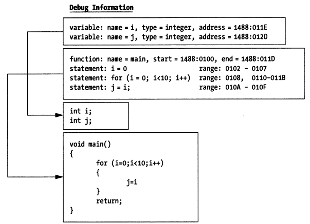
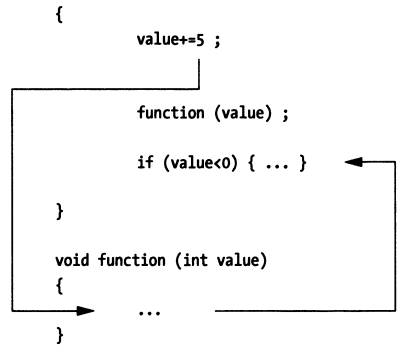

## 4.2 依赖（支持）

### 4.2.1 调试符号信息

编译器、连接器根据源代码构建可执行程序，可执行程序中的数据是面向极其的，而非面向人类的。

符号级调试器如何理解可执行程序中的数据，并在面向机器的数据和面向人类的源码信息之间进行转换呢？

这就需要调试符号表的支持了。当编译器将源代码转换成目标文件的时候，编译器会生成一些调试符号并将其存储到可执行程序文件中的特殊的section中。当连接器将多个目标对象文件连接成一个完整的可执行程序的时候，连接器会将分散在不同目标文件中的调试符号进行合并，然后存储到调试符号表中。



这里的调试符号如何生成、编解码、存储等是有相应的调试信息标准指导的，调试信息标准指引着编译器、连接器、调试器之间如何进行协作，如DWARF。编译器、连接器生成这些调试信息并将其存储到可执行程序的相应section中，调试器会读取可执行程序数据，并从中提取、解析与调试相关的信息，然后就可以构建起源码层面的视图。进而，调试器可以完成内存地址、指令地址、源码之间的相互映射。

In practice, depending on the format of the object file, debug symbol table records are typically placed in one of two locations:

不同的目标文件格式，调试符号表可能会存储在不同的地方，一般可能有两种存储方式：

- 存储在目标文件自身

    For example, [ELF](https://en.wikipedia.org/wiki/Executable_and_Linkable_Format) object format contains DWARF Debug symbol table.

    例如，[ELF](https://en.wikipedia.org/wiki/Executable_and_Linkable_Format) 文件格式包含了DWARF调试符号表对应的section，一般以".debug”或”.zdebug”开头。.debug开头的表示数据未压缩，.zdebug开头的表示数据经过了压缩。

    >这里给个实例，__debug_bin是一个由`dlv debug`生成的可执行程序，包含了调试符号信息，`readelf`可以用来读取ELF文件中的section header，下面我们列一下ELF文件中包含的调试信息相关的 section。
    >
    >```bash
    >[root@centos ~]# readelf -a __debug_bin | grep debug
    >[12] .zdebug_abbrev    PROGBITS         0000000000599000  0017b000
    >[13] .zdebug_line      PROGBITS         0000000000599114  0017b114
    >[14] .zdebug_frame     PROGBITS         00000000005a9f37  0018bf37
    >[15] .zdebug_pubnames  PROGBITS         00000000005b11a8  001931a8
    >[16] .zdebug_pubtypes  PROGBITS         00000000005b2fa0  00194fa0
    >[17] .debug_gdb_script PROGBITS         00000000005b624b  0019824b
    >[18] .zdebug_info      PROGBITS         00000000005b6273  00198273
    >[19] .zdebug_loc       PROGBITS         00000000005dcfe2  001befe2
    >[20] .zdebug_ranges    PROGBITS         00000000005e982d  001cb82d
    >```

- 存储在独立的文件

    例如，Microsoft Visual C++ 2.0生成的调试信息存储在独立的.PDB（Program Database）文件中，macOS平台上构建的调试符号信息一般存储在独立的.dSYM文件中。
    
    >这里给个示例，在macOS 10.15上，通过gcc -g构建一个包含调试符号的可执行程序，我们看下它生成的调试信息是如何存储的：
    >
    >**file: main.c**
    >
    >```cpp
    >#include <stdio.h>
    >#include <stdlib.h>
    >
    >int main(int argc, char *argv[])
    >{
    >	return 0;
    >}
    >
    >```
    >
    >```bash
    >$ gcc -g -o main main.c
    >$ ls
    >main main.c main.dSYM/
    >$ tree main.dSYM
    >main.dSYM/
    >└── Contents
    >├── Info.plist
    >└── Resources
    >   └── DWARF
    >       └── main
    >```
    >
    >可以看到，macOS 10.15上，gcc将调试信息也存储到了独立文件中main.dSYM。

调试符号信息有什么用呢？调试器利用调试符号能够将源码中的函数、变量映射为内存中的地址，也就意味着开发者可以直接对源码中函数、变量进行操作而不用关心具体的内存地址，这也是符号级调试器相比于指令级调试器的一大优势。

借助源码到内存地址的映射，符号级调试器就可以直接显示变量的值，如何做到的呢？因为变量标识符可以映射成程序的数据段地址（栈地址或者堆地址），此外，符号表中还记录了该变量的数据类型信息，这里的类型信息告诉调试器该变量一共占用多少个字节、实际用了多少比特、应该解读成哪种数据类型，调试器就可以正确显示变量的值。



这里的映射关系也包含从源代码语句与内存中代码段指令地址范围的映射，这个也是符号级调试器的优势。当希望单步执行一条语句的时候，调试器可以根据该语句对应的地址范围决定应该执行多少条指令后停下来。

### 4.2.2 调试支持

除了调试符号信息，调试器还需要其他的一些支持，即调试基础设施，包括：调试中断、系统调用、解释器、调试用户界面（GUI或者命令行）。

#### 4.2.2.1 调试中断

所有的商用操作系统都提供了调试相关的hook机制，这里的hook机制通常是通过内核系统调用的形式实现。为什么要通过系统调用实现呢？调试器调试应用程序的时候，需要读、写程序的数据、指令，就涉及到访问系统内存中一些受保护的特殊数据结构，普通用户进程是无权访问的，只能借助内核提供的系统调用来代表用户进程操作。

相比之下有个例外，DOS操作系统是实模式操作系统，由于没有对内存做保护，你可以直接做任何事情。

#### 4.2.2.2 系统调用

现在，绝大多数操作系统都实现了内存保护模式，内存保护模式是多用户、多任务操作系统的根基。如果没有保护模式，根本就不存在所谓的安全。关于内存保护模式如何实现的，可以参考X86系列处理器的演进发展史。

与DOS相反，Windows、Linux以及BSD都实现了内存保护模式，这意味着如果你想在这些平台上开发一个调试器，就需要通过平台提供的系统调用来实现。

以Linux系统调用为例，调试器进程（tracer）可以通过`ptrace(PTRACE_ATTACH…)` attach到一个被调试进程（tracee），然后操作系统内核会给tracee进程发送一个信号SIGSTOP，tracee进程就会停下来，tracer进程就可以通过`waitpid(pid)`来等待tracee停止事件。当tracer进程感知到tracee进程停止执行之后，tracer进程就可以进一步通过`ptrace`系统调用、配合其他ptrace参数`PTRACE_GETREGS、PTRACE_SETREGS、PTRACE_PEEKDATA、PTRACE_POKEDATA等`来读写tracee进程寄存器、内存数据（what，进程还有寄存器、内存数据？如果想不明白，可以了解下操作系统进程控制块PCB的概念以及Linux下taskstruct、GDT、LDT相关的知识）、控制代码的执行路径等。

> Linux平台对SIGSTOP信号的处理，可以参考：[How does SIGSTOP work in Linux kernel?](https://stackoverflow.com/questions/31946854/how-does-sigstop-work-in-linux-kernel)

#### 4.2.2.3 解释器

如果是调试一门解释型的语言，那就比通过系统调用的方式直接多了，因为所有的调试基础设施都可以直接内建在解释器中。通过一个解释器，就可以无限制地访问执行引擎。所有的调试操作及其依赖的能力都是运行在用户空间而非内核空间，也就不需要借助系统调用了。没有什么东西是被隐藏的。所要做的就是增加扩展来处理断点、单步执行等操作。

#### 4.2.2.4 内核调试器

操作系统构建起严格的内存保护模式之后，要想调试内核本身，就得通过一种特殊类型的调试器。传统的用户模式下的调试器是不行的，因为保护内存模式（如段、页式管理的相关逻辑）阻止了用户态程序操作内核映像。

你需要一个内核调试器！

内核调试器，能够指挥、控制中央处理器（CPU），这样就可以通过单步执行、断点等操作对内核代码进行调试、检查。这意味着内核调试器必须能够避开内存保护模式机制，通常内核级调试器都是与操作内核镜像打包在一起的。有些厂商要实现自己的内核级调试器，也会考虑将调试器作为设备驱动、可加载的内核模块的方式来设计、开发。

#### 4.2.2.5 调试用户界面

可能你还没注意到，调试关心的都是程序的状态。不同的调试器为用户提供了不同的方式来查看正在运行的程序的状态。某些调试器（例如gdb）进提供简单但一致的命令行界面。其他调试器可能会与GUI环境进行集成。我倾向于使用GUI调试器，因为GUI调试器能够同时呈现和访问更多的机器状态信息。使用GUI调试器，您可以轻松地同时监视数十个程序元素。

另一方面，如果你正在开发跨平台的应用程序，则可能很难找到在所有平台上都能运行的GUI IDE，这个时候跨平台的命令行调试器相比GUI调试器来说就有优势了。GNU调试器可能没有精美的GUI接口，但在任何平台上其命令行操作和行为都是一样的。命令行调试器相比GUI调试器拥有更陡峭的学习曲线，但是一旦你掌握了，你就可以跨平台调试你的应用程序。

### 4.2.3 符号调试器扩展

#### 4.2.3.1 动态断点

程序断点breakpoint，指的是程序中的一个位置，当程序执行到该位置时能够停下来，以便调试人员观察程序状态。

如果有动态断点的概念，那应该也有一个静态断点的概念，没错，这两种断点都存在。

> 除了动态断点、静态断点，还有软件断点和硬件断点，前者是通过机器指令来实现，后者是借助处理器提供的调试寄存器来实现，这里我们先讨论软件断点，有需要的话会在后文介绍硬件断点。

X86平台上创建软件断点可以通过指令`int 3`来生成**0xCC**这个一字节机器指令来创建，处理器执行完0xCC之后会暂停当前执行的进程。

具体是如何执行的呢？int 3表示会触发3号中断，对应机器指令是0xCC，处理器执行完该指令后就会触发3号中断，对应的中断服务就在IDT[3]中。BIOS中提供的中断服务程序是16位的，了解过Linux构建32位、64位内存保护模式的话，就会明白Linux启动后，IDT[3]指向的其实是Linux内核提供的中断处理程序，这里就是暂停执行当前tracee进程，并通知tracer进程tracee暂停执行。

好，现在理解了0xCC机器指令的用途之后，我们可以继续讨论静态断点和动态断点的区别：

1. **静态断点**

    静态断点指的是这样的断点，它是在程序中的某些位置通过硬编码的方式来创建的，如在程序中通过`int 0x3`汇编指令创建断点。静态断点的生命周期与进程的生命周期是相同的。我们可以在程序中插入一些分支判断逻辑，来决定是否创建特定的静态断点。

    一些获取、设置内存、寄存器的汇编指令也可以按需在代码中硬编码。

    比较好的解决方法是，上述创建静态断点、读写内存、读写寄存器等的操作封装成库的形式，这样就方便其他程序以共享库、静态库的方式来访问，用起来会方便点。

    静态断点不够灵活，定位一个问题，可能需要反复修改源码、调试，动态断点相比之下优势明显。

2. **动态断点**

    In the previous part, I used static breakpoint instructions that were manually inserted at compile time. An alternative to this approach is to **dynamically insert breakpoints into a program’s memory image at runtime**. As you will see later on, this allows symbolic debuggers to single-step through a program at the source code level.

    Unlike static breakpoints, which exist for the duration of a program’s lifecycle, symbolic debuggers usually work with dynamic breakpoints. The insertion, and removal of dynamic breakpoints obyes the following scheme:

    - The debugger identifies the first opcode of a statement
    - The debugger saves the opcode and replaces it with a breakpoint (0xCC)
    - The debugger digests the breakpoint and halts execution
    - The debugger restores the original opcode
    - The debugger leaves the opcode or swaps in another breakpoint

    Let’s take the following statement in C as an example:

    Total = total +value;

    Providing the associated assembly is as following:

    

    To place a dynamic breakpoint on a statement, the debugger would take the first opcode 0x8B and replace it with a breakpoint instruction 0xCC. When the debugger encounters this breakpoint, it will replace the breakpoint with the opcode and then execute the entire statement.

    Once the statement has been executed, the debugger then has the option to swap back in the breakpoint or to leave the instruction alone. If the breakpoint was originally inserted via an explicit request by the user (i.e., break source.c:17), it will be reinserted again. However, if the breakpoint was initially inserted to support single stepping, the breakpoint will not be reinserted.

#### 4.2.3.2 单步执行

Single stepping in a machine-level debugger is simple: the processor simply executes the next machine instruction and returns program control to the debugger. For a symbolic debugger, this process is not as simple because a single statement in a high-level programming language typically translates into several machine-level instructions. You can’t simply have the debugger execute a fixed number of machine instructions because high-level source code statements vary in terms of how many machine-level instructions they resolve to.

To single-step, a symbolic debugger has to use dynamic breakpoints. The nature of how dynamic breakpoints are inserted will depend upon the type of single stepping being performed. There are three different types of single stepping:

1. **单步执行进入 (下一条语句)**

    When a symbolic debugger steps into a source code statement, it scans the first few machine instructions to see if the statement is a functions invocation. If the first opcode of the next instruction is not part of a function invocation, the debugger will simply save the opcode and replace it with a breakpoint. Otherwise, the debugger will determine where the function invocation jumps to, in memory, and replace the first opcode of the function’s body with a breakpoint such that execution pauses after the function has been invoked.

    

2. **单步执行跳出 (一个函数)**

    When a source-level debugger steps out of a routine, it looks through the routine’s activation record for a return address. It then saves the opcode of the machine instruction at this return address and replaces it with a breakpoint. When program execution resumes, the routine will complete the rest of its statements and jump to its return address. The execution path will then hit the breakpoint, and program control will be given back to the debugger. The effect is that you are able to force the debugger’s attention out of a function and back to the code that invoked it.

3. **单步执行跳过 (下一条语句)**

    When a source-level debugger steps over a statement, it queries the program’s symbol table to determine the address range of the statement in memory (this is one scenario in which the symbol table really comes in handy). Once the debugger has determined where the statement ends, it saves the opcode of the first machine instruction following the statement and replaces it with a breakpoint. When execution resumes, the debugger will regain program control only after the path of execution has traversed the statement.

    
