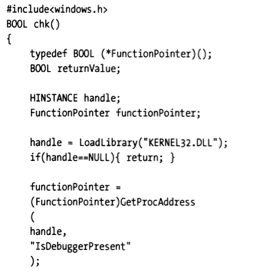
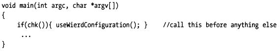
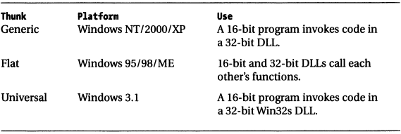

## 4.3 应对战术

Give enough time and effort, any program can be reverse engineered. The goal, then, is to make it as painful as possible for a malicious engineer to figour out how things work. In light of this, there’re steps that you can take that will make it difficult for someone to peek at your program with a debugger. In this section, I will examine a few of these steps.

只要付出足够的时间和精力，可以说任何程序都可以进行被逆向。 调试器使得恶意工程师理解程序逻辑更加方便了，这里的应对战术，其实是为了增加点软件逆向的难度，使恶意工程师越痛苦越好以阻止或者延缓他们弄清程序的正确工作方式。

鉴于此，我们可以采取一些步骤，这将使恶意工程师很难通过调试器窥视您的程序。

### 4.3.1 系统调用

#### 4.3.1.1 Windows
某些操作系统提供了一个特殊调用，该系统调用将指示当前进程是否在调试器的调试模式下执行。 例如，Windows KERNEL32.DLL导出一个名为`IsDebuggerPresent()`的函数。 您可以将此调用包装在诸如chk()之类的函数中。




该技术的窍门是程序启动后立即调用chk()。 这将增加在调试器遇到第一个断点之前chk代码被执行的可能性。



如果观测到调试器正在调试当前进程，则可以强制程序运行异常、诡异，让正在调试的人懵逼。 调试器是个独特的工具，因为它使用户可以从中立的角度来观察程序。 通过插入类似chk的代码，可以迫使用户进入一个扭曲的量子宇宙，在该宇宙中，精心构造的诡异行为、输出可以有效保护您的程序，避免或者延缓被逆向。

#### 4.3.1.2 Linux

在Linux下，也有类似的方式，通常可以借助”`/proc/self/status`“中的”`TracerPid`“属性来判断是否有调试器正在调试当前进程。下面是一个Linux下检查当前进程是否在被调试器调试的示例。

> 下面是个示例，展示下在Linux上如何检查当前进程是否正在被调试：
>
> ```go
> package main
> 
> import "fmt"
> import "os"
> 
> func main() {
> 
>      fmt.Println("vim-go, pid: %d", os.Getpid())
> }
> ```
>
> ```bash
> $ dlv debug main.go
> dlv> b main.main
> dlv> c
> dlv> n
> dlv> n
> dlv> vim-go, pid: 746
> ```
>
> ```bash
> >cat /proc/746/status | grep TracePid
> TracePid: 688
> > cat /proc/688/cmdline
> dlv debug main.go
> ```
>
> 现在我们可以判断出当前进程正在被pid=688的调试器进程调试，并且该调试器是dlv。

#### 4.3.1.x 其他平台

略。

### 4.3.2 移除调试信息

One simple way to make debugging more expensive is to remove debugging information from your deliverable. This can be done by stripping debug information (with a tool like GNU’s strip utility) or by setting your development tools to generate a release build.

Some business software companies prefer to strip debug information and accept the associated performance hit, because it allows sales engineers to perform an on-site diagnosis. When sales engineers make a house call, all that they need to do in order to take a look under the hood is insert the debug information and crank up a debugger.

The gcc compiler uses the **option -g** to insert debug information in the object code that it generates. If the option is not specified, then no symbol information will be included for debugging purposes.

If you try and debug this with gdb, it will complain that it cannot find any debugging symbols. The absence of debugging symbols will make it very difficult to see what’s going on in terms of anything but raw machine state.


The absence of debugging symbols will not stop everyone, some decompilers out there can take machine code and recast it as high-level source code. The good news is that these tools tend to generate code that is difficult to read and use arbitrary naming conventions. In other words, the cure is almost as bad as the illness.

### 4.3.3 代码加盐

If memory footprint is not a big issue, and you don’t mind a slight performance hit, one way to foil a debugger is to periodically salt your code with unnecessary statements. This will make it easy for someone trying to reverse engineer your code to become lost among the trees and lose sight of the forest, so to speak.

In this manner, even if you shipped this program with debug symbols, it would be difficult to figure out what was happening (particularly if you believed that each statement had a legitimate purpose).

### 4.3.4 混合内存模型

There’re robust debuggers, like SoftICE, that can gracefully make the jump between user mode and kernel mode. However, not many debuggers can make the jump between two different memory models. Windows in particular is guilty of allowing this kind of abomination to occur. On Windows, this phenomenon is generally known as thunking, and it allows 16-bit code and 32-bit code to fraternize.

Following depicts the thunking techniques used in Windows:


