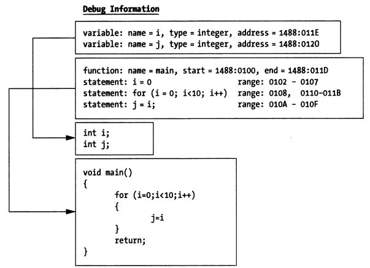
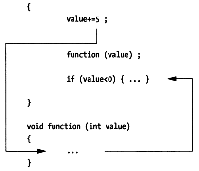

## 4.2 Dependencies

### 4.2.1 Debug Symbol Info

The **compiler and linker build the executable file** based on source code. The data of executable file is generated for machine, rather than for human. 

How does a source level **debugger understand that data and remap it to source information** or vice versa?

This depends on the **debug symbol table**. When the compiler converts source code into object file, it will also generate the self-contained debug symbols. When the linker links all object files into the executable file, it will merge the debug symbols stored in these object files into the debug symbol table.

There’s some **standards to guide the compiler to generate debugging symbols** to coordinate the compiler, linker and debugger, **such as Dwarf**. Compiler and linker generate these debugging sections and store them into the executable file, debugger can extract these sections to build a source level view, then debugger can do some remapping task between memory address, instruction address and source code.

In practice, depending on the format of the object file, debug symbol table records are typically placed in one of two locations:

- In the body of the object code itself

    For example, [ELF](https://en.wikipedia.org/wiki/Executable_and_Linkable_Format) object format contains Dwarf debug symbol table.

- In a separate file

    For example, Microsoft’s Visual C++ 2.0 debug information is stored in a separate *.PDB (Program Database) file. macOS application debugging symbols *.dSYM is separate, too.

Debug symbol information maps functions and variables to locations in memory, this is what gives a symbolic debugger the fundamental advantage over a machine instruction debugger. For instance, the source code to memory mapping allows a symbolic debugger to display the value of a variable, because the variable’s identifier is matched to a specific location in the program’s data segment (stack or heap). Not only that, but there will also be data type information in the symbol table that will tell the debugger what type of data is manipulated so that its value can be properly displayed.

This mapping also matches source code statements to ranges of bytes in memory. When you step into a source code statement, the symbolic debugger will look up the address range of the given statement in the program’s debug records. Then it will simply execute the machine instructions in that range.

### 4.2.2 Debug Infrastructure

Besides the debug symbol info, some other dependencies are still needed, i.e., the debug infrastructure, including debugging interrupts, system calls, interpreters, debug interface (GUI or command-line).

#### 4.2.2.1 Debugging Interrupts

All of the commercial operating systems provide hooks for debugging. These hooks are usually implemented as system calls inside of the kernel. This is as necessary because debugging an application requires access to system data structures that exist in a protected region of memory, i.e., the kernel. The only way to manipulate these special data structures is to politely ask the operating system to do so on your behalf.

One exception to this rule occurs in the case of DOS. With DOS, a real mode operating system, you can do damn nearly everything by yourself because memory protection does not exist.

#### 4.2.2.2 System Calls

Nowadays, most operating systems implement memory’s protective mode, it is the base stone of multi-user, multi-task operating system. If there’s no protective mode, there’s no so-called security at all.

Opposite to DOS, Windows, Linux and BSD have fairly sophisticated memory protection scheme. This means that if you want to write a debugger, you’ll need to rely on the system calls.

Take Linux system calls as an example, the tracee process can be attached via **ptrace(PTRACE_ATTACH…)**, then the tracee will be notified by **SIGSTOP** sent by kernel, then tracee will stop, tracer process can call **waitpid(pid)** to wait this happens. After that, tracer process can call ptrace with other request param (PTRACE_GETREGS, PTRACE_SETREGS, PTRACE_PEEKDATA, PTRACE_POKEDATA…) to further inspect the tracee runtime state and control its code execution path.

#### 4.2.2.3 Interpreters

As regards with debugging an interpreted language, it is much more direct than the system call approach because all of the debugging facilities can be built directly into the interpreter. Within an interpreter, you have unrestricted access to the execution engine. The entire thing can run in user space instead of kernel space (syscall). Nothing is hidden. All you need to do is add extensions to process breakpoint instructions and support single stepping.

#### 4.2.2.4 Kernel Debuggers

When an operating system institutes strict memory protection, a special type of debugger is needed to debug the kernel. You cannot use a conventional user-mode debugger because memory protection facilities (like segmentation and paging) prevent it from manipulating the kernel’s image. 

Instead, what you need is a kernel debugger.

A kernel debugger is an odd creature that commandeers control the processor so that the kernel can be examined via single stepping and breakpoints. This means that the kernel debugger must somehow sidestep the native memory protection scheme by merging itself into the operating system’s memory image. Some vendors perform this feat by designing their debuggers as device drivers, or loadable kernel modules.

#### 4.2.2.5 Debug Interface

In case you haven’t noticed, it’s all about program state. Different debuggers offer different ways for a user to view the state of a running program. Some debuggers, like gdb, provide only a simple, but consistent, command-line interface. Other debuggers are integrated into slick GUI environments. To be honest, I lean towards the GUI debuggers because they are capable of presenting and accessing more machine state information at any given point in time. With a GUI debugger, you can easily monitor dozens of program elements simultaneously.

On the other hand, if you are developing an application that will be deployed on multiple platforms, it may be difficult to find a GUI IDE that runs on all of them. This is the great equalizer for command-line debuggers. The GNU debugger may not have a fancy interface, but it looks (and behaves) the same everywhere. Once you jump the initial learning curve, you can debug executables on any platform that gdb has been ported to.

### 4.2.3 Symbol Debugger Extensions

#### 4.2.3.1 Dynamic Breakpoints

If there’s a term called dynamic breakpoints, there may be a term called static breakpoints. Yes, both of them exist.

Breakpoints are created by generating **0xCC one-byte machine instruction**, 0xCC causes processor to pause the running process. If you write assembly, `int 0x3` can be used to generate this instruction 0xCC。After understanding purpose of 0xCC, we can continue discussing the breakpoints’ types, the static breakpoints and the dynamic breakpoints.

1. **Static breakpoints**

    Static breakpoints refers to the breakpoints generated by `int 0x3` assembly which are **programmatically inserted into the program source code**. These breakpoints’ lifetime is as the same of this process. We can insert branch control logic, which can be enabled or disabled by arguments, to determine whether specific breakpoints are enabled or not.

    Some assembly instruction for getting/setting memory/registers can also be inserted.

    Better solution is to encapsulate the relevant assembly operation into a library, which can be linked and used conveniently for any other programs.

2. **Dynamic breakpoints**

    In the previous part, I used static breakpoint instructions that were manually inserted at compile time. An alternative to this approach is to **dynamically insert breakpoints into a program’s memory image at runtime**. As you will see later on, this allows symbolic debuggers to single-step through a program at the source code level.

    Unlike static breakpoints, which exist for the duration of a program’s lifecycle, symbolic debuggers usually work with dynamic breakpoints. The insertion, and removal of dynamic breakpoints obyes the following scheme:

    - The debugger identifies the first opcode of a statement
    - The debugger saves the opcode and replaces it with a breakpoint (0xCC)
    - The debugger digests the breakpoint and halts execution
    - The debugger restores the original opcode
    - The debugger leaves the opcode or swaps in another breakpoint

    Let’s take the following statement in C as an example:

    Total = total +value;

    Providing the associated assembly is as following:

    

    To place a dynamic breakpoint on a statement, the debugger would take the first opcode 0x8B and replace it with a breakpoint instruction 0xCC. When the debugger encounters this breakpoint, it will replace the breakpoint with the opcode and then execute the entire statement.

    Once the statement has been executed, the debugger then has the option to swap back in the breakpoint or to leave the instruction alone. If the breakpoint was originally inserted via an explicit request by the user (i.e., break source.c:17), it will be reinserted again. However, if the breakpoint was initially inserted to support single stepping, the breakpoint will not be reinserted.

#### 4.2.3.2 Single Stepping

Single stepping in a machine-level debugger is simple: the processor simply executes the next machine instruction and returns program control to the debugger. For a symbolic debugger, this process is not as simple because a single statement in a high-level programming language typically translates into several machine-level instructions. You can’t simply have the debugger execute a fixed number of machine instructions because high-level source code statements vary in terms of how many machine-level instructions they resolve to.

To single-step, a symbolic debugger has to use dynamic breakpoints. The nature of how dynamic breakpoints are inserted will depend upon the type of single stepping being performed. There are three different types of single stepping:

1. **Single stepping into (the next statement)**

    When a symbolic debugger steps into a source code statement, it scans the first few machine instructions to see if the statement is a functions invocation. If the first opcode of the next instruction is not part of a function invocation, the debugger will simply save the opcode and replace it with a breakpoint. Otherwise, the debugger will determine where the function invocation jumps to, in memory, and replace the first opcode of the function’s body with a breakpoint such that execution pauses after the function has been invoked.

    

2. **Single stepping out of (a routine)**

    When a source-level debugger steps out of a routine, it looks through the routine’s activation record for a return address. It then saves the opcode of the machine instruction at this return address and replaces it with a breakpoint. When program execution resumes, the routine will complete the rest of its statements and jump to its return address. The execution path will then hit the breakpoint, and program control will be given back to the debugger. The effect is that you are able to force the debugger’s attention out of a function and back to the code that invoked it.

3. **Single stepping over (the next statement)**

    When a source-level debugger steps over a statement, it queries the program’s symbol table to determine the address range of the statement in memory (this is one scenario in which the symbol table really comes in handy). Once the debugger has determined where the statement ends, it saves the opcode of the first machine instruction following the statement and replaces it with a breakpoint. When execution resumes, the debugger will regain program control only after the path of execution has traversed the statement.

    
