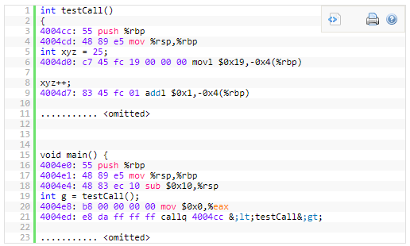
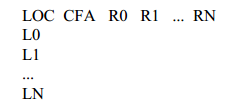
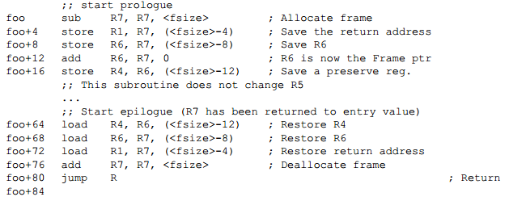
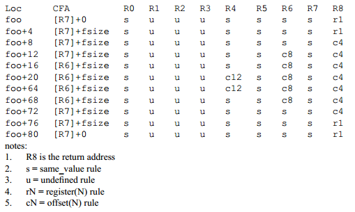
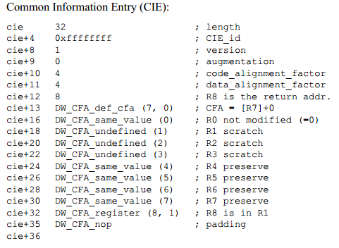
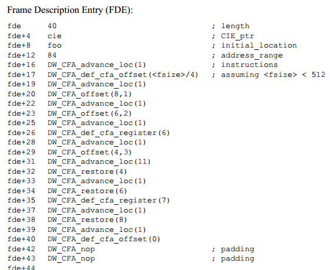
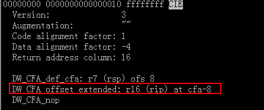

### 1.1.2 Inspect Call Frame

#### 1.1.2.1 Purpose

Debuggers often need to view and modify the state of frame on the call frame stack. To be able to view or modify a frame that is not on the top of the call frame stack, the debugger must *virtually unwind* the stack of call frame util it finds the frame of interest. Virtually Unwind means it has the logic effect of returning from the current subroutine to its predecessor, but it can still *rewind* the stack back to the state it was in before it attempted to unwind it, just thinking *gdb commands like bt, frame $n, info frame*.

 

Dwarf v2 provides a way to describe the call frame information which is stored in section .debug_frame, and the basic idea of .debug_frame is to allow debuggers to figure out how to unwind frames, i.e., how to restore the previous frame from any instruction executing using the current frame.

 

For Example, consider the following assembly (with C code inline – objdump -S):

For example, when we are inside testCall (i.e. from 4004cc onward), at every instruction, the .debug_frame information should allow us to restore all registers (such as rbp, rsp, eax etc.) to their previous status in the caller’s frame (here the caller is main). **This is done by keeping a table structure that keeps track of all the changes that happens with each register for every line of assembly.**

 

#### 1.1.2.2 CIE & FDE

As is mentioned above, we need keeping a table structure that keeps track of all the changes that happens with each register for every line of assembly. 

#### 1.1.2.3 Table Structure

Dwarf supports virtual unwinding by defining an architecture independent basis for recording how procedures save and restore registers throughout their lifetimes. The basis must be augmented on some machines with specific information that is defined by either an architecture specific ABI authoring committee, a hardware vendor, or a compiler producer. The body defining a specific augmentation is referred to below as the augmenter.

 

In this table:

1)    LOC, it’s the address of assembly (for example 4004cc), possible values are the address of each instruction.

2)    CFA, it’s the call frame address, which uses a register and an offset to calculate the CFA.

3)    R0~RN: they’re the registers that the particular architecture has, they record whether the registers’ values has been changed and how the value is changed.

Possible values are:

\-       Undefined(u): has no value in previous frame, it’s not preserved by a callee.

\-       Same(s): hasn’t been modified from previous frame, it’s not preserved by the callee, but the callee doesn’t modify it.

\-       Offset(N): previous value of this register is stored at the address CFA+N where CFA is the current CFA value and N is a signed offset.

\-       Register(R): previous value of this register is stored at the register number R.

\-       Architectural: the rule is defined externally to this specification by the augmenter.

In essence, the .debug_frame section and its corresponding cryptic tags are used to help the user construct such table.

 

#### 1.1.2.4 Build Table

Take following code as an example:

 

The .debug_frame can be used to generate following table:

 

 

How to build this table?

 

1)    In section .debug_frame, each compilation unit has a single Common Information Entry (CIE), CIE describes how to built the first row in this table by the initial instructions included in this CIE, for example, *cie+13~cie+35* can be used for building the first row *foo [R7]+0 s u u u s s s s r1*.

 

 

*A CIE holds information that is shared among many Frame Descriptions. There is at least one CIE in every non-empty .debug_frame section. Often, a compilation unit has a single CIE entry, which may contains a slice of FDE entries. A CIE has the following fields: length, CIE_id, version, augmentation, code_alignment_factor, data_alignment_factor, return_address_register, initial_instructions, padding.*

 

2)    Each CIE has a slice of FDEs, among which each FDE has a pointer to this CIE. These FDEs can be used for building the following rows in this table by the included instructions in this FDE.

 

 

*A FDE holds information about a call frame, it has the following fields: length, CIE_pointer, initial_location, address_range, instructions.*

*The field **initial_location** refers to the address of the first assembly in this FDE, the **address_range** refers to the number of bytes of Dwarf DW_CFA_... instructions used for recreating the table row. When specifying a PC, we can use this expression **(PC - fde.initial_location < fde.address_range)** to check whether this PC (instruction address) is within the range of this FDE. Actually we need to traverse the FDEs in the CIE to check which FDE covers the PC.*

 

Ref: http://ucla.jamesyxu.com/?p=231

 

3)    Call Frame Instructions

\-       DW_CFA_advance_loc(delta), advance delta * code_alignment_factor,

\-       DW_CFA_def_cfa_register(R), takes a single unsigned LEB128 argument R representing a register number. The required action is to define the current CFA rule to use the provided register (but to keep the old offset).

\-       DW_CFA_def_cfa_offset(N), takes a single unsigned LEB128 argument N representing an offset. The required action is to define the current CFA rule to use the provided offset  (but to keep the old register).

\-       DW_CFA_offset(R, N), takes R as register number and N as offset to CFA, this create a offset(N) rule on register numbered R.

\-       DW_CFA_restore(R), takes R as register number, it applies the rule assigned by CIE to R before to this register again in this new row.

 

According to this instructions stored in CIE or FDEs, we can know how to build the table structure.

 

#### 1.1.2.5 Calc ReturnAddress

 

How to calculate the ReturnAddress given any instruction in current frame?

1)    Calculate the CFA according to the table mentioned in 3.1.5.4.

CFA is specified by a register (golang uses RSP) and an offset, because Dwarf instruction DW_CFA_... cannot affect RSP’s value, so when PC of instruction is specified, we can directly execute instructions in the single FDE covering this PC to get the CFA.

*Remark: If we want get other registers’ values, we must execute all the predessesor FDEs’ instructions, then excute the FDE’s instructions which covering this PC. Only by this, other registers’ values can be affected rightly.*

2)    Confirm which register holds the return address by CIE.return_address_register, this register maybe a virtual one (not an actual machine register), such as CFA-8 used in golang’s CIE, which refers to a memory address, then we can use ptrace to peek the data  stored in this memory address, this is the return address.

 

Here is an golang CIE sample, DW_CFA_offset_extended: r16 (rip) at cfa-8, it defines that register numbered 16 is not an actual machine register, actually it points to a memory unit with address cfa-8.

 

 

*Note:* 

*CFA is short for Canonical Frame Address or Caller Frame Address rather than ReturnAddress. Here’s an issue which describes this point:* [*https://github.com/derekparker/delve/issues/1181*](https://github.com/derekparker/delve/issues/1181)*.*

Also, you can checkout this repo to validate this issue: https://github.com/hitzhangjie/golang-debugger at revision <9097961>.