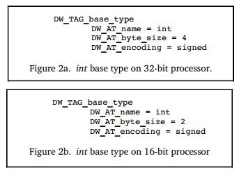

### 5.3.2 描述数据和类型

大多数编程语言都提供了对数据类型的描述，包括内置的基本数据类型和创建新数据类型的方法。 DWARF旨在支持所有编程语言，因此它抽象出了一种描述所有语言特性的解决方案。

DWARF根据机器硬件抽象出几种基本类型（数值类型），其他类型定义为基本类型的集合或组合。

#### 5.3.2.1 基本类型（base types）

DWARF v1和其他调试信息格式，都假定编译器和调试器需要对基本类型的大小有共同的了解，例如int是8位，16位还是32位。相同语言在不同硬件平台上，数据类型相同的情况下，其尺寸可能也不同。一个int类型在16位处理器上可能是16位，而在32位处理器上可能是32位。不同语言在相同的硬件平台上，数据类型相同的情况下，其尺寸也可能不同，如go语言int在64位处理器上为64位，而在C语言中为32位。

那么问题来了，如何将基本类型灵活地映射为不同的bitsize？ DWARF v2解决了此问题，它提供了一种低级映射方案，可以实现“**简单数据类型**”和“**目标计算机硬件上的实现**”之间的灵活映射。

**这里有3个实例:**

Figure 2a 定义类型 int 在32位处理器上是4字节有符号数值, 图 2b 定义类型 int 在16位处理器上是2字节有符号数值。

图 3 定义类型word是16位有符号数值，该类型实际占用4字节，但只有高位2个字节被使用，低位2个字节全部为0。

DW_TAG_base_type, this tag allows a number of base types to be described, including binary integer, packed integer, address, character, fixed number and floating number. Floating number’s encoding format (such as IEEE-754) is determined by the hardware. 

DW_TAG_base_type，此tag用来描述多种基本类型，包括二进制整数，压缩（packed）整数，地址，字符，定点数和浮点数。 浮点数的编码格式（例如IEEE-754）由硬件决定。

#### 5.3.2.2 类型组合（type composition）

DWARF通过组合或者链接基本数据类型来定义新的数据类型。

图 5中，定义了一个变量px，其类型通过DW_AT_type=<2>引用另一个DIE DW_TAG_pointer_type，是一个指针类型，该DIE内部由通过DW_AT_type=<3>引用另一个描述基本数据类型的DIE DW_TAG_base_type，该基本数据类型为4字节有符号整数。最终我们可以确定变量px是一个纸箱int类型的指针。

其他数据类型也可以通过链接多个DIE（DW_TAG…+DW_AT_type…）来定义一个新的数据类型，例如reference类型可以给予DW_TAG_pointer_type来构建。

#### 5.3.2.3 数组（array）

数组对应的DIE，该DIE包含了这样的一些属性来描述数组元素是按照“**行主序**”还是按照“**列主序**”存储，如Fortran是按照列主序存储，C和C++是按照行主序存储。数组的索引值范围，DIE中也需要通过指定最小、最大索引值来给出一个有效的索引值区间。这样DWARF就可以既能够描述C风格的数组（用0作为数组起始索引），也能够描述Pascal和Ada的数组（数组最小索引值、最大索引值是可以变化的）。

#### 5.3.2.4 Structures, Classes, Unions, and Interfaces

大多数编程语言都允许通过组合多种不同的数据类型来定义一个新的数据类型，例如struct。

Struct允许组合多个不同类型的成员。C语言中联合union也允许这样做，但是不同的成员共享相同的存储空间。C++ struct相比C语言又增加了一些特性，允许添加一些成员函数。C++中class和Java中interface在某种程度上是非常相似的程序实体。

不同语言一般都有相似的组合数据类型，只是取的名字可能不同，比如C++中叫class和class members（类和类成员），在Pascal中叫Record和Fields（记录和字段）。DWARF抽象这些描述时也要选个合适的名字，这里采用了C++中的术语。

描述class的DIE是描述该class members的DIEs的父级DIE，每个class都有一个名字和可能的属性（成员）。如果class实例的大小在编译时可以确定，描述class的DIE就会多一个属性DW_AT_byte_size。class及class member的描述与基本数据类型描述的方式并没有太大的不同，可能会增加一些其他的描述信息，如class member的访问修饰符。

C\C++中也支持结构体位字段，即struct中多个成员可以共享同一个字节，只是不同的成员可以使用位数不同的相邻的比特。这个可以通过属性DW_AT_bit_offset和DW_AT_bit_size共同进行描述。DW_AT_bit_size描述了一共占用多少个字节，DW_AT_bit_size描述了实际占用多少bits。

#### 5.3.2.5 变量（Variables）

Variables are generally pretty simple, they have a name which presents a chunk of memory (or register) that store the value. Variable’s type describes what value is contained and whether it can be modified (such as const) or not. 

What distinguishes a variable is where its value is stored and its scope.

- A variable can be stored at global data section, stack, heap or register. 

- Variable’s scope describes where it can be known in the program, to some extent, its scope is determined by declaration. Dwarf documents where the variable is defined in triplet (file, line, column).

#### 5.3.2.6 Location

Dwarf provides a very general schema to describe how to locate the data represented by a variable. That is Dwarf location attribute DW_AT_location, which specifies a sequence of operations to tell debugger how to locate the data.  

Following is an example to show how DW_AT_location attribute helps to locate the variable address.

Figure 7 depicts that variable b is stored in a register, variable c is stored at stack, variable a is stored at fixed address (data section).

The debugging information must provides consumers a way to find the location of program variables, determine the bounds of of dynamic arrays and strings and possibly to find the base address of a subroutine’s stack frame or the return address of a subroutine. Furthermore, to meet the needs of recent computer architectures and optimization techniques, the debugging information must be able to describe the location of an object whose location changes over the objects’ lifetime.

Information about the location of program object is provided by location descriptions. Location descriptions can be classified into two forms:

- **Location expressions**, which are a language independent representation of addressing rules of arbitrary complexity built from a few basic building blocks, operations. They are sufficient for describing the location of any object as long as its lifetime is either static or the same as the lexical block that owns it, and it does not move throughout its lifetime.

- **Location lists**, which are used to describe objects that have a limited lifetime or change their location throughout their lifetime.

#### 5.3.2.7 Location Expression

A location expression consists of zero or more location operations. An expression with zero operations is used to denote an object that is present in the source code but not present in the object code (perhaps because of optimization). 

**The location operations fall into two categories, register names and addressing operations**:

- Register names
- Address operations

##### 5.3.2.7.1 Register names

Register names always appear alone and indicate that the referred object is contained inside a particular register.  

Note that the register number represents a Dwarf specific mapping of numbers onto the actual registers of a given architecture. `DW_OP_reg${n} (0<=n<=31)` operations encode the names of up to 32 register, the object is addressed in register n. `DW_OP_regx` operation has a single unsigned LEB128 literal operand that encodes the name of a register.

##### 5.3.2.7.2 Address operations

Address operations are memory address computation rules. All location operations are **encoded as a stream of opcodes that are each followed by zero or more literal operands**. The number of operands is determined by the opcode.  

Each addressing operation represents a **postfix operation on a simple stack machine**. 

- Each element of the stack is the size of an address on the target machine;
- The value on the top of the stack after executing the location expression is taken to be the result (the address of the object, or the value of the array bound, or the length of a dynamic string). 

In the case of locations used for structure members, the computation assumes that the base address of the containing structure has been pushed on the stack before evaluation of the address operation.

**There’re several address operation manners, including:**  

1. **Register Based Addressing**  

   Register based addressing, push a value onto the stack that is the result of adding the contents of a register with a given signed offset.

   -   DW_OP_fbreg \$offset, adding contents in frame base register (rbp) with $offset.

   - DW_OP_breg\${n} \${offset}, adding contents in register ${n} with LEB128 encoded offset.
   - DW_OP_bregx \${n} ${offset}, adding contents in register whose number is LEB128 encoded  with a LEB128 encoded offset .

2. **Stack Operations**  

   The following operations all push a value onto the addressing stack:  

   - DW_OP_lit\${n} (0<=n<=31), encode the unsigned literal values ${n}.
   - DW_OP_addr, encode the machine address that matches the target machine.
   - DW_OP_const1u/1s/2u/2s/4u/4s/8u/8s, encode 1/2/4/8 bytes unsigned or signed integer.
   - DW_OP_constu/s, encode LEB128 unsigned or signed integer.

   Following operations manipulate the location stack, location operations that index the location stack assumes that the top of the stack has index 0.  

   - DW_OP_dup, duplicates the top stack entry and pushes.
   - DW_OP_drop, pops the value at the top of stack.
   - DW_OP_pick, picks the stack entry specified by 1-byte ${index} and pushes.
   - DW_OP_over, duplicate the stack entry with index 2 and pushes.
   - DW_OP_swap, swap two stack entries, which are specified by two operands.
   - DW_OP_rot, rotate the top 3 stack entries.
   - DW_OP_deref, pops the value at the top of stack as address and retrieves data from that address, then pushes the data whose size is the size of address on target machine.
   - DW_OP_deref_size, similar to DW_OP_deref, plus when retrieveing data from address, bytes that’ll be read is specified by 1-byte operand, the read data will be zero-extended to match the size of address on target machine.
   - DW_OP_xderef & DW_OP_xderef_size, similar to DW_OP_deref, plus extended dereference mechanism. When dereferencing, the top stack entry is popped as address, the second top stack entry is popped as an address space identifier. Do some calculation to get the address and retrieve data from it, then push the data to the stack.

3. **Arithmetic and Logical Operations**

   DW_OP_abs, DW_OP_and, DW_OP_div, DW_OP_minus, DW_OP_mod, DW_OP_mul, DW_OP_neg, DW_OP_not, DW_OP_or, DW_OP_plus, DW_OP_plus_uconst, DW_OP_shl, DW_OP_shr, DW_OP_shra, DW_OP_xor, all these operations works similarly, pop the operands from the stack and calculate, then push value to the stack.

4. **Control Flow Operations**

   The following operations provide simple control of flow of a location expression.

   - Relational operators, the six operators each pops the top two stack entries and compares the top first one with the second one, and pushes value 1 if the result is true or pushes value 0 if the result is false.
   - DW_OP_skip, unconditional branch, its operand is a 2-byte constant representing the number of bytes of the location expression to skip from current location expression, beginning after the 2-byte constant.
   - DW_OP_bra, conditional branch, this operation pops the stack, if the popped value is not zero, then skip some bytes to jump to the location expression. The number of bytes to skip is specified by its operand, which is a 2-byte constant representing the number of bytes of the location expression to skip from current locating expression, beginning after the 2-byte constant.
   
5. **Special Operations**

   There’re two special operations currently defined in Dwarf 2:

   - DW_OP_piece, many compilers store a single variable in a set of registers, or store partially in register and partially in memory. DW_OP_piece provides a way of describing how large a part of a variable a particular address location refers to.
   - DW_OP_nop, it’s a placeholder, it has no effect on the location stack or any of its values. 

   The location operations mentioned above are described conventionally, following are some examples. 

   - Stack Operation Sample

   

   - Location Expression Sample

   ​		Here are some examples of how location operations are used to form location expressions.

​					

#### 5.3.2.8 Location Lists

Location lists are used in place of location expressions whenever the object whose location can be changed during its lifetime. Location lists are contained in a separate object file section **.debug_loc**. 

A location list is indicated by a constant offset from the beginning of the .debug_loc to the first byte of this list for the object in question. 

Each entry in location list consists of:

- A beginning address, it is relative to the base address of the compilation unit referring to this location list, it marks the beginning of the address range over which the location is valid.
- An ending address, it is again relative to the base address of the compilation unit referring to this location list, it marks the end of the address range over which the location is valid.
- A location expression, it describes the location of the object over range specified by the beginning and end address. 

The end of any location list is marked by a 0 for the beginning address and a 0 for the end address, no location description is provided. 

>Dwarf 5 will replace .debug_loc and .debug_ranges with .debug_loclists and .debug_rnglists allowing more compact representation and eliminating relocations.

#### 5.3.2.9 Further Reading

- Types of Declarations, please refer to DwarfStandards 3.2.2.1 and 3.2.2.2.
- Accessibility of Declarations, some languages provides support for accessibility of an object or some other program entity, this can be specififed by attribute DW_AT_accessibility, whose value is a constant drawn from the set of codes listed here: DW_ACCESS_public, DW_ACCESS_private, DW_ACCESS_protected.
- Visualbility of Declarations, it specifies which declaration are to be visible outside of the module in which they are declared, this can be specified by attribute DW_AT_visualbility, whose value is constant drawn from the set of codes listed here: DW_VIS_local, DW_VIS_exported, DW_VIS_qualified.
- Virtuality of Declarations, C++ provides support for virtual and pure virtual structure or class member functions and for virtual base classes, this is specified by attribute DW_AT_virtuality, whose value is a constant drawn from codes listed here: DW_VIRTUALITY_none, DW_VIRTUALITY_virtual, DW_VIRTUALITY_pure_virtual.
- Artificial Entries, a compiler may wish to generate debugging information entries for objects and types that were not actually declared in the source of the application. An example is a formal parameter entry to represent the hidden **this** parameter that most C++ implementations pass as the first argument to non-static member functions.
- Declaration coordinates, any DIE representing the declaration of an object, module, subprogram or type may have DW_AT_decl_file, DW_AT_decl_line and DW_AT_decl_column attributes, each of whose value is a constant.

