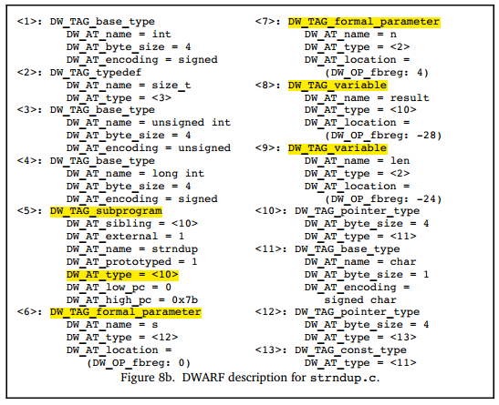
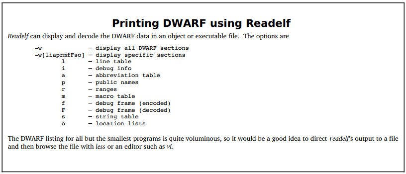

### Dwarf 2

### structure

DWARF uses a data structure called a Debugging Information Entry (DIE) to represent each variable, type, procedure, etc. A DIE has a tag (e.g., DW_TAG_variable, DW_TAG_pointer_type, DW_TAG_subprogram…) and set of attributes (key-value pairs). A DIE can have nested (child) DIEs, forming a tree structure. A DIE attribute can refer to another DIE anywhere in the tree—for instance, a DIE representing a variable would have a DW_AT_type entry pointing to the DIE describing the variable's type.

**To save space, two large tables needed by symbolic debuggers are represented as byte-coded instructions for simple, special-purpose finite state machines.**

1. **The Line Number Table**, which maps code locations to source code locations and vice versa, also specifies which instructions are part of function prologues and epilogues. 

2. **The Call Frame Information table**, which allows debuggers to locate frames on the call stack.

### DIE

Each debugging information entry is described by **an identifying tag** and contains **a series of attributes**. The tag specifies the class to which an entry belongs, and the attributes define the specific characteristics of the entry.

The debugging information entries in Dwarf v2 are intended to exist in the **.debug_info** section of an object file.

#### Tag

Tag, specifies what the DIE describes, the set of required tag names is listed in following figure.

#### Attribute

Attribute, fill in details of DIE and further describes the entity.

An attribute has a variety of values: constants (such as function name), variables (such as start address for a function), or references to another DIE (such as for the type of functions’ return value).

The permissive values for an attribute belong to one or more classes of attribute value forms. Each form class may be represented in one or more ways. 

For instance, some attribute values consist of a single piece of constant data. “Constant data” is the class of attribute value that those attributes may have. There’re several representations of constant data, however (one, two, four, eight bytes and variable length data). The particular representation for any given instance of an attribute is encoded along with the attribute name as part of of the information that guides the interpretation of a debugging information entry.

The set of required attribute names is listed in following figure.

**Remark: Attribute value forms may belong to one of the following classes:**

1. Address, refers to some location in the address space of the described program.

2. Block, an arbitrary number of uninterpreted bytes of data.

3. Constant, one, two, four or eight bytes of uninterpreted data, or data encoded in LEB128.

4. Flag, a small constant that indicates the presence or absence of the an attribute.

5. Reference, refers to some member of the set of DIEs that describe the program.

6. String, a null-terminated sequence of zero or more (non-null) bytes. Strings maybe represented directly in the DIE or as an offset in a separate string table.

#### Form

Briefly, DIE can be classified into 2 forms: 

1. the one to describe the data type

2.  the one to describe the function and executable code

One DIE can have parent, siblings and children DIEs, dwarf debugging info is constructed as a tree in which each node is a DIE, several DIE combined to describe a entity in programming language (such as a function).

In following sections, types of DIEs will be described before we dive into dwarf further.

### Describing Data and Type

Most of programming languages provide sophisticated description of data types, including the builtin basic data type and the method to create new data type. Dwarf aims to support all programming languages, so it abstracts out a solution to represent all languages.

Dwarf abstracts out several base types (number) based on the hardware, other types are constructed as collections or composition of base types.

#### Base Types

Dwarf v1 and other debugging formats suppose that compiler and debugger need sharing common understanding of the size of base type, such as whether an int is 8, 16 or 32 bits. Same language on different hardware platforms may have different size of the same type, an int could be 16 bit on 16 bit processor and 32 bit on 32 bit processor. But different language on the same hardware platform may have different size of the same type, such as golang int is 64 bit on 64 bit processor, while in C it is 32 bit.

So the problem is how to remapping the base type to different bit size flexibly? Dwarf v2 solves this issue, it provides the lowest level mapping between the simple data types and how they are implemented on the target machine’s hardware. 

**Here is 3 examples:**

Figure 2a depicts that type int is 4 byte signed numer on 32-bit processor, figure 2b depicts that int is 2 byte signed number on 16-bit processor.

 

figure 3 depicts that type word is 16 bit signed number, while it takes up 4 bytes, in which only the first 2 upper bytes is used, leading the lower 2 bytes zero.

 

 

DW_TAG_base_type, this tag allows a number of base types to be described, including binary integer, packed integer, address, character, fixed number and floating number. floating number’s encoding format (such as IEEE-754) is determined by the hardware. 

#### Type Composition

Dwarf defines a new data type via grouping or chaining builtin base types. 

Figure 5 depicts that variable px is defined, its data type DW_AT_type = <2> references DW_TAG_pointer_type, this pointer byte size is 4 byte, this pointer type is defined via modifying base type int (DW_AT_type = <3>), which is defined by DW_AT_base_type. 

Other data types can also be defined via chaining several DW_TAG_...., such as reference type can be built based on DW_TAG_pointer_type. 

#### Array

Array is defined in a DIE which specifies whether the elements is stored in column major order (as in Fortran) or row major order (as in C or C++). The index for the array is specified by a subrange type that gives the lower and upper bounds of each dimension. This allows dwarf to describe both C style arrays, which always have zero as the lowest index, as well as arrays in Pascal or Ada, which can have any value for the low and high bounds. 

#### Structures, Classes, Unions, and Interfaces

Most programming languages allow programmer to group different data types into a new compositive type, such as struct.

Struct allows grouping several members of different types. C union allows this too, but every member shares the same space. C++ struct add some features beyond of C. C++ class and Java interfaces are similar entities to some extent. 

Different languages may have nearly the same compositive data type, but data type name differs, such as C++ class and class members are called Record and Fields in Pascal, Dwarf uses the terminology in C\C++\Java. 

DIE for a class is a parent for DIEs of class members, each class has a name and other possible attributes. If the size of class instance is known at compile time, the DIE will have a DW_AT_byte_size attribute. Each of these descriptions are very similar to a base type, which may be added some more details, such as class members accessibility modifier. 

C\C++ also allow bit field in struct, this can be described in attribute DW_AT_bit_offset and DW_AT_bit_size combined with DW_AT_byte_size. Bit offset and bit size specify how many bits is taken up and where it is stored, byte size specifies total space taken up by the struct.

#### Variables

Variables are generally pretty simple, they have a name which presents a chunk of memory (or register) that store the value. Variable’s type describes what value is contained and whether it can be modified (such as const) or not. 

What distinguishes a variable is where its value is stored and its scope.

1. A variable can be stored at global data section, stack or register. 

2. Variable’s scope describes where it can be known in the program, to some extent, its scope is determined by declaration. Dwarf documents where the variable is defined in triplet (file, line, column).

#### Location Expressions

##### Introduction

Dwarf provides a very general schema to describe how to locate the data represented by a variable. That is Dwarf location attribute DW_AT_location, which specifies a sequence of operations to tell debugger how to locate the data.  

Following is an example to show how DW_AT_location attribute helps to locate the variable address.

Figure 7 depicts that variable b is stored in a register, variable c is stored at stack, variable a is stored at fixed address (data section).

##### Further Reading

*The debugging information must provides consumers a way to find the location of program variables, determine the bounds of of dynamic arrays and strings and possibly to find the base address of a subroutine’s stack frame or the return address of a subroutine. Furthermore, to meet the needs of recent computer architectures and optimization techniques, the debugging information must be able to describe the location of an object whose location changes over the objects’ lifetime.*

*Information about the location of program object is provided by location descriptions. Location descriptions can be classified into two forms:*

1. Location expressions, which are a language independent representation of addressing rules of arbitrary complexity built from a few basic building blocks, operations. They are sufficient for describing the location of any object as long as its lifetime is either static or the same as the lexical block that owns it, and it does not move throughout its lifetime.

2. Location lists, which are used to describe objects that have a limited lifetime or change their location throughout their lifetime.

##### Location Expression

*A location expression consists of zero or more location operations. An expression with zero operations is used to denote an object that is present in the source code but not present in the object code (perhaps because of optimization). **The location operations fall into two categories, register names and addressing operations.*** 

1. **Register names** always appear alone and indicate that the referred object is contained inside a particular register.

	>Note that the register number represents a Dwarf specific mapping of numbers onto the actual registers of a given architecture. DW_OP_reg${n} (0<=n<=31) operations encode the names of up to 32 register, the object is addressed in register n. DW_OP_regx operation has a single unsigned LEB128 literal operand that encodes the name of a register.

2. **Address operations** are memory address computation rules. All location operations are encoded as a stream of opcodes that are each followed by zero or more literal operands. The number of operands is determined by the opcode.

	>Each addressing operation represents a postfix operation on a simple stack machine. Each element of the stack is the size of an address on the target machine. The value on the top of the stack after executing the location expression is taken to be the result (the address of the object, or the value of the array bound, or the length of a dynamic string). In the case of locations used for structure members, the computation assumes that the base address of the containing structure has been pushed on the stack before evaluation of the address operation.

	**There’re several address operation manners, including:**

	- Register Based Addressing

		Register based addressing, push a value onto the stack that is the result of adding the contents of a register with a given signed offset.

      - DW_OP_fbreg $offset, adding contents in frame base register (rbp) with $offset.

      - DW_OP_breg${n}, adding contents in register ${n} with LEB128 encoded offset.

      - DW_OP_bregx, adding contents in register whose number is LEB128 encoded  with a LEB128 encoded offset .

	- Stack Operations

		a. The following operations all push a value onto the addressing stack:

      - DW_OP_lit${n} (0<=n<=31), encode the unsigned literal values ${n}.
      - DW_OP_addr, encode the machine address that matches the target machine.
      - DW_OP_const1u/1s/2u/2s/4u/4s/8u/8s, encode 1/2/4/8 bytes unsigned or signed integer.
      - DW_OP_constu/s, encode LEB128 unsigned or signed integer.
     
      b. Following operations manipulate the location stack, location operations that index the location stack assumes that the top of the stack has index 0.

       - DW_OP_dup, duplicates the top stack entry and pushes.
       - DW_OP_drop, pops the value at the top of stack.
       - DW_OP_pick, picks the stack entry specified by 1-byte ${index} and pushes.
       - DW_OP_over, duplicate the stack entry with index 2 and pushes.
       - DW_OP_swap, swap two stack entries, which are specified by two operands.
       - DW_OP_rot, rotate the top 3 stack entries.
       - DW_OP_deref, pops the value at the top of stack as address and retrieves data from that address, then pushes the data whose size is the size of address on target machine.
       - DW_OP_deref_size, similar to DW_OP_deref, plus when retrieveing data from address, bytes that’ll be read is specified by 1-byte operand, the read data will be zero-extended to match the size of address on target machine.
       - DW_OP_xderef & DW_OP_xderef_size, similar to DW_OP_deref, plus extended dereference mechanism. When dereferencing, the top stack entry is popped as address, the second top stack entry is popped as an address space identifier. Do some calculation to get the address and retrieve data from it, then push the data to the stack.

3. Arithmetic and Logical Operations

*DW_OP_abs, DW_OP_and, DW_OP_div, DW_OP_minus, DW_OP_mod, DW_OP_mul, DW_OP_neg, DW_OP_not, DW_OP_or, DW_OP_plus, DW_OP_plus_uconst, DW_OP_shl, DW_OP_shr, DW_OP_shra, DW_OP_xor, all these operations works similarly, pop the operands from the stack and calculate, then push value to the stack.*

4. Control Flow Operations

The following operations provide simple control of flow of a location expression.

- Relational operators, the six operators each pops the top two stack entries and compares the top first one with the second one, and pushes value 1 if the result is true or pushes value 0 if the result is false.

- DW_OP_skip, unconditional branch, its operand is a 2-byte constant representing the number of bytes of the location expression to skip from current location expression, beginning after the 2-byte constant.

- DW_OP_bra, conditional branch, this operation pops the stack, if the popped value is not zero, then skip some bytes to jump to the location expression. The number of bytes to skip is specified by its operand, which is a 2-byte constant representing the number of bytes of the location expression to skip from current locating expression, beginning after the 2-byte constant.* 

5. Special Operations

*There’re two special operations currently defined in Dwarf 2:*

- DW_OP_piece, many compilers store a single variable in a set of registers, or store partially in register and partially in memory. DW_OP_piece provides a way of describing how large a part of a variable a particular address location refers to.

- DW_OP_nop, it’s a placeholder, it has no effect on the location stack or any of its values. 

  

The location operations mentioned above are described conventionally, following are some examples. 

1. Stack Operation Sample

 

2. Location Expression Sample

Here are some examples of how location operations are used to form location expressions.

 

 

##### Location Lists

Location lists are used in place of location expressions whenever the object whose location can be changed during its lifetime. Location lists are contained in a separate object file section .debug_loc. 

A location list is indicated by a constant offset from the beginning of the .debug_loc to the first byte of this list for the object in question. 

Each entry in location list consists of:

1. A beginning address, it is relative to the base address of the compilation unit referring to this location list, it marks the beginning of the address range over which the location is valid.

2. An ending address, it is again relative to the base address of the compilation unit referring to this location list, it marks the end of the address range over which the location is valid.

3. A location expression, it describes the location of the object over range specified by the beginning and end address. 

The end of any location list is marked by a 0 for the beginning address and a 0 for the end address, no location description is provided. 

*Remark: I’m a little confused with this, and Dwarf 5 will replace .debug_loc and .debug_ranges with .debug_loclists and .debug_rnglists allowing more compact representation and eliminating relocations.*

 

#### Further Reading

1. Types of Declarations, please refer to 3.2.2.1 and 3.2.2.2.

2. Accessibility of Declarations, some languages provides support for accessibility of an object or some other program entity, this can be specififed by attribute DW_AT_accessibility, whose value is a constant drawn from the set of codes listed here: DW_ACCESS_public, DW_ACCESS_private, DW_ACCESS_protected.

3. Visualbility of Declarations, it specifies which declaration are to be visible outside of the module in which they are declared, this can be specified by attribute DW_AT_visualbility, whose value is constant drawn from the set of codes listed here: DW_VIS_local, DW_VIS_exported, DW_VIS_qualified.

4. Virtuality of Declarations, C++ provides support for virtual and pure virtual structure or class member functions and for virtual base classes, this is specified by attribute DW_AT_virtuality, whose value is a constant drawn from codes listed here: DW_VIRTUALITY_none, DW_VIRTUALITY_virtual, DW_VIRTUALITY_pure_virtual.

5. Artificial Entries, a compiler may wish to generate debugging information entries for objects and types that were not actually declared in the source of the application. An example is a formal parameter entry to represent the hidden **this** parameter that most C++ implementations pass as the first argument to non-static member functions.

6. Declaration coordinates, any DIE representing the declaration of an object, module, subprogram or type may have DW_AT_decl_file, DW_AT_decl_line and DW_AT_decl_column attributes, each of whose value is a constant.

 

### Describing Executable Code

#### Functions and SubPrograms

1. subprogram

   Functions (also called subprogram) may has return value or not, Dwarf use DIE DW_AT_subprogram to represent both these two cases. This DIE has a name, a source location triplet, and an attribute which indicates whether the subprogram is external, that is, visible outside the current compilation unit.

2. subprogram address range

   A subprogram DIE has attributes DW_AT_low_pc, DW_AT_high_pc to give the low and high memory addresses that the subprogram occupies. In some cases, maybe the subprogram memory address is continuous or not, if not, there’ll be a list of memory ranges. The low pc is assumed to be the entry point of subprogram unless another one is specified explicitly.

3. subprogram return type

   A subprogram’s return value’s type is described by the attribute DW_AT_type within DIE DW_TAG_subprogram. If no value returned, this attribute doesn’t exist. If return type is defined within the same scope with this subprogram, the return type DIE will also be an sibling of this DIE subprogram.

4. subprogram formal parameters

   A subprogram may have zero or several formal parameters, which are described by DIE DW_TAG_formal_parameter, will be listed after the DIE subprogram as the same order as declared in parameter list, though DIE of parameter type may be interspersed. Mostly, these formal parameters are stored in registers.

5. subprogram variables

   A subprogram body may contains local variables, these variables are described by DIE DW_TAG_variables listing after formal parameters’ DIEs. Mostly, these local variables are allocated in stack. 

6. lexical block

   Most programming language support lexical block, there’s may be some lexcical blocks in subprogram, which can be described DIE DW_TAG_lexcical_block. Lexical block may contain variable and lexical block DIEs, too. 

   Following is an example showing how to describe a C function.

 

​	Generated Dwarf information is as following: 

 

Referring to 1)~5) content, this example easy to be understood.

 

#### Compilation Unit

Most Program contain more than one source file. When building program, each source file are treated as a independent compilation unit, which will be independently compiled to *.o (such as C), then these object files will be linked with system specific startup code and system libraries to build the executable program. 

Dwarf adopts the terminology Compilation Unit from C as the DIE name, DW_TAG_compilation_unit. The DIE contains general information about the compilation, including the directory and name of the file name, the used programming language, producer that generated the Dwarf information and the offsets to help locate the line number and macro information. 

If the compilation unit takes up continuous memory (i.e., it’s loaded into memory in one piece), then there’re values for the low and high memory addresses for the unit, which are low pc and high pc attributes. This helps debugger determine which compilation generate the code (instruction) at particular memory address much more easiliy.  

If the compilation is not continuous, then a list of the memory address that the code takes up is provided by the compiler and linker.

 

#### Data Encoding 

Dwarf data conceptually is a tree of DIE, DIE may has children or siblings, each DIE may has several attributes. Dwarf data is unwieldly, so it must be compressed to reduce the size, then the compressed data is stored into the object file. 

Dwarf provides serveral methods to compress the data. 

1. Use prefix traversal to flatten the tree. 

   Prefix traversal the Dwarf tree, the accessed tree node DIE is stored. By this way, the links between DIE and its children DIEs and sibling DIEs are eliminated. When reading  Dwarf data, maybe jumping to the next sibling DIE is needed, the sibling DIE can be stored as an attribute in current DIE. 

2. Use abbreviation to avoid store duplicated values.

   Instead of storing the value of the TAG and attribute-value pairs, only an index into a table of abbreviations is stored, followed by attributes codes. Each abbreviation gives the TAG value, a flag indicating whether the DIE has children, and a list of attributes with the type of value it expects. 

   

Figure 9 is an example of using abbreviation:

 

Less commonly used are features of Dwarf 3 and 4 which allow references from one compilation unit to the Dwarf data stored in another compilation unit.

 

### Other Dwarf Data

#### Line Number Table 

The Dwarf line number table contains the mapping between the memory address of executable code of a program and the source lines that corresponds to these address. 

In the simplest form, this can be looked as a matrix with one column contains the instruction address while another column contains the source line triplet (file, line, column). When setting a breakpoint of a source line, query this table to find the first instruction and set a breakpoing. When program has a fault during execucation, query current instruction address related source line to analyze it.

As we imagined, if this table were stored with one row one each instruction, this line number table would be too huge. How to compress it? Dwarf encodes it as a sequence of instructions called a line number table program. These instructions are interpreted by a simple finite state machine to recreate the complete line number table. Also, when recreating the complete line number table, only the first machine instruction of each source statement is stored into the table.

By means of this, line number table is compressed. 

#### Macro Information 

Most debuggers have a very difficult time displaying and debugging code which has macros. The user sees the original source file, with the macros, while the code corresponds to whatever the macros generated. 

Dwarf includes the description of the macros defined in the progam. This is quite rudimentary information, but can be used by a debugger to display the values for a macro or possibly translate the macro into the corresponding source language. 

#### Call Frame Information 

Every processor has a certain way of determining how to pass parameters and return values, this is defined by the processor’s ABI (Application Binary Interface). In the simplest case, all functions have the same way to pass parameters and return values, and the debuggers know exactly how to get the parameters and return values. 

But actually, not every processor uses the same way to pass parameters and to return values. Besides, compilers may do some optimization to make generated instructions much smaller and faster. For example, maybe a simple function is created to use caller’s local variables as parameters instead of passing parameters to callee to avoid create frame, maybe to optimize the usage of registers, maybe others… The result is a small change takes place in the optimizations and the debugger may no longer be able to walk the stack to the calling functions. 

Dwarf call frame information (CFI) provides the debugger enough information about how a function is called, how to locate the parameters to the functions, how to locate the call frame for the calling function. This information is used by the debugger to unwind the stack, locating the previous function, the location where the function is called, and the values passed. 

Like the line number table, CFI is also encoded as a sequence of instructions that are interpreted to generate a table. There’s one row for each address that contains code. The first column contains the machine address, while others contain the registers’ values at when instruction at that address is executed. Like the line number table, the complete CFI is huge. Luckily, there’s very little change between two instructions, so the CFI encoding is quite compact. 

#### Variable Length Data 

Integer values are used throughout Dwarf to represent everything from offsets into data sections to sizes of arrays or structures. Since most values can be represented in only a few bits, this means that the data consists mostly of zeros. 

Dwarf defines a variable length integer, called Little Endian Base 128 (LEB128 for signed integers or ULEB128 for unsigned integers), which compresses the bytes taken up to represent the integers.  

Wiki: https://en.wikipedia.org/wiki/LEB128 

#### Shrinking Dwarf data 

The encoding schemes used by Dwarf significantly reduce the size of the debugging information compared to the Dwarf v1. But unfortunately, many programs’ debugging information generated by compilers still can be very large, frequently larger than the executable code and data. 

Dwarf offers ways to further reduce the size of the debugging data. This part could be neglected here for now, as far as I am concerned. 

#### ELF Sections

While Dwarf is defined in a way that allows it to be used with any object file format, it’s most often used with ELF.  

Each of the different kinds of Dwarf data are stored in their own section. The names of these sections all start with prefix ‘.debug_’. For improved efficiency, most references to Dwarf data use an offset from the start of the data for current compilation. This avoids the need to relocate the debugging data, which speeds up program loading and debugging. 

The ELF sections and their contents are:

1. .debug_abbrev, abbreviations used in .debug_info

2. .debug_arranges, a mapping between memory address and compilation

3. .debug_frame, call frame info

4. .debug_info, the core Dwarf data containing DIE

5. .debug_line, the line number program (sequence of instructions to generate the complete the line number table)

6. .debug_loc, location descriptions

7. .debug_macinfo, macro information

8. .debug_pubnames, a lookup table for global object and functions

9. .debug_pubtypes, a lookup table for global types

10. .debug_ranges, address ranges referenced by DIEs

11. .debug_str, string table used by .debug_info

12. .debug_types, type descriptions

 

### Summary 

The basic concepts for the Dwarf are quit straight-forward. A program is described as a tree with nodes representing the various functions, data and types in the source in a compact language and machine-independent fashion. 

The line table provides the mapping between the executable instructions and the source that generated them. The CFI describes how to unwind the stack.

There is quite a bit of subtlety in Dwarf as well, given that it needs to express the many different nuances for a wide range of programming languages and different machine architectures. 

By using ‘**gcc -g -c filename.c**’ can generate the Dwarf debugging information and stored it into the object file filename.o.  

 

By using ‘**readelf -w**’ can read and display all Dwarf debugging information. By using ‘readelf -w’ and specifying flags can read and display specific Dwarf debugging information.  

